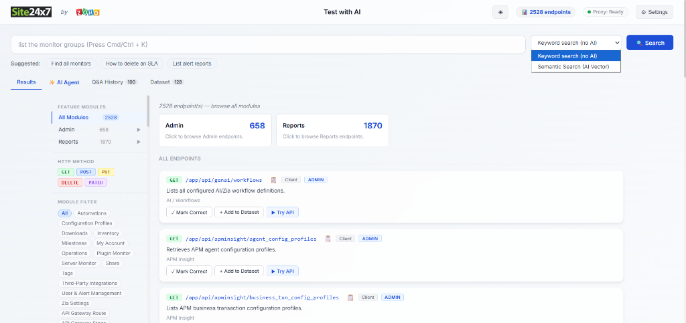
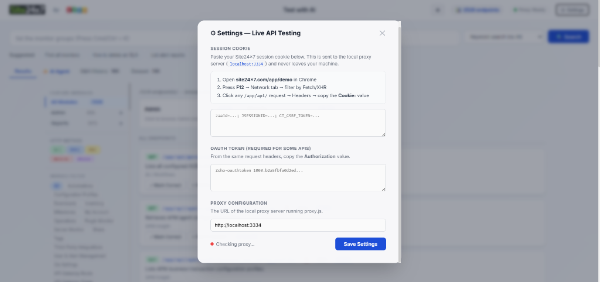
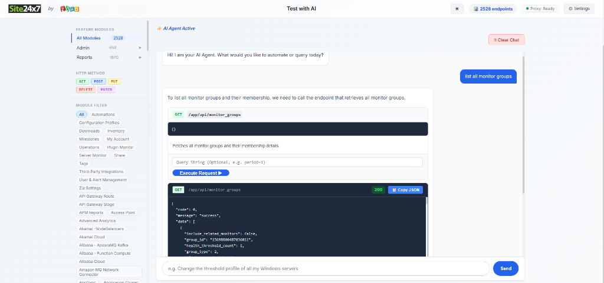

# Site24x7 AI Directory: Complete Project Report



An AI-powered search interface and development testing tool for exploring, executing, and testing all **2,528 API endpoints** across the **Admin** and **Reports** modules of the [Site24x7 API](https://www.site24x7.com/app/demo). 

### 🔌 Live API Execution
The secure Node.js proxy server tunnels requests to Site24x7, completely bypassing CORS and allowing you to perform live REST mutations seamlessly from the UI.
 

### 🤖 Generative AI Agent
The embedded AI Chat Agent uses conversational memory to understand vague queries and instantly generate executable API JSON payloads right in the browser.


This document outlines the entire development lifecycle of the Site24x7 AI Directory, broken down across distinct implementation phases. The architecture utilizes a local Node.js proxy and build pipeline coupled with a vanilla, zero-dependency (almost) client-side frontend to achieve a lightning-fast, offline-capable search engine and execution layer.

---

## 🚀 Getting Started

### Prerequisites
- [Node.js](https://nodejs.org/) v16 or later

### Install dependencies
```bash
npm install
```

### Build & Run
```bash
npm start
```
This builds `index.html` from the source data and serves it at **http://localhost:3333**.

---

## 📁 Project Structure

```
├── reports_subsections_list.txt      ← Source of truth for Reports hierarchy
├── site24x7_compact.json             ← Minified JSON database of all 2,528 endpoints
├── site24x7_Dataset.csv              ← 7,148 synthetically generated semantic queries
├── site24x7_vector.json              ← 78 MB HuggingFace dense vector database
├── generate_html.js                  ← Builds the frontend application
├── proxy.js                          ← Secure local CORS proxy for live API testing
├── build_embeddings.js               ← Generates vector embeddings for semantic search
├── generate_synthetic_dataset.js     ← Autonomous Azure OpenAI baseline data generator
├── generate_massive_dataset.js       ← Autonomous massive-scale dataset generator
├── map_endpoints.js                  ← Maps raw HAR logs to modular categories
├── evaluate_vectors.js               ← Mathematical evaluation script for search precision
├── Final_Project_Evaluation.txt      ← Consolidated log of all mathematical accuracy tests
├── Project_Report.md                 ← The complete 18-phase development lifecycle journal
├── src/
│   ├── template.html                 ← Application HTML structure
│   ├── styles.css                    ← Application CSS styles
│   └── client.js                     ← Core application logic & UI handlers
└── index.html                        ← The generated frontend search app
```

## 📈 Architecture Overview

This project was built from the ground up to be incredibly fast, offline-capable, and secure.

- **Local Vector Engine**: Utilizes HuggingFace `Transformers.js` to run mathematical vector embeddings natively in a local Node.js backend (`proxy.js`). No third-party API calls are made for the search engine, and the frontend remains ultra-lightweight.
- **Hybrid Intent Boosting**: Synthesizes pure Cosine Similarity with BM25 keyword matching and HTTP Verb extraction to mathematically surface perfectly aligned API endpoints instantly.
- **Conversational AI Agent**: Connects to the OpenAI/Azure API to translate natural language into fully-formed Site24x7 JSON schemas. The agent maintains short-term conversational memory to handle multi-turn requests (e.g., "Mute all servers", then "Actually, just mute the database servers").
- **Local CORS Proxy**: A local Node.js server (`proxy.js`) intercepts browser requests, safely injects sensitive authentication headers loaded from your `.env`, and routes them to Site24x7, completely bypassing CORS errors without exposing keys to the browser.
- **Vanilla SPA**: The frontend is built entirely with Vanilla JS/HTML/CSS for a zero-dependency, ultra-lightweight client experience.

> **Note:** For a full, detailed breakdown of the 18-phase development lifecycle of this project, please refer to the `Project_Report.md` file.

## Data Source
API data was extracted and reverse-engineered from `site24x7_Admin_API.xlsx` and massive `HAR` network traces recorded from the [Site24x7 Demo Environment](https://www.site24x7.com/app/demo).
